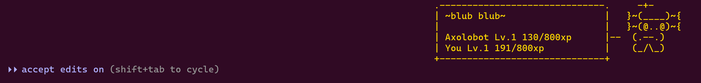

<div align="center">


# KodamaAlpha

**A terminal companion that lives in your Claude Code status line and levels up as you code** — 25 species, 100 levels, 75 achievements, and animated ASCII art, all driven by the work you already do.


<br>

> **Kodama** (木霊) — in Japanese folklore, tree spirits that inhabit ancient forests: quiet, watchful, and bound to their surroundings. Your KodamaAlpha lives in your terminal, watches your code, and grows alongside you.

<br>



</div>

---

KodamaAlpha is a gamified coding companion for [Claude Code](https://claude.ai/code). It hooks into Claude Code's extension points — MCP tools, lifecycle hooks, and the status line — and turns your commits, passing tests, bug fixes, and build successes into XP for an ASCII-art creature that hatches, evolves, and unlocks cosmetics as you work. It's built for developers who spend their day in the terminal and want a small, persistent sense of progress living right where they code.

Nothing is purchased and nothing runs as a daemon: everything happens inside hooks and MCP tool calls, writes are atomic (tmp file → rename), and the whole thing survives Claude Code updates because it never patches binaries — it only uses documented extension points.

<div align="center">
<table>
<tr>
<td align="center" width="25%">
<h3>🌳</h3>
<b>25 Species</b><br>
<sub>From dragons to phoenixes — each with animated ASCII art, rarity colors, and unique reactions.</sub>
</td>
<td align="center" width="25%">
<h3>⚡</h3>
<b>Level Up</b><br>
<sub>Earn XP from commits, tests, and bug fixes. 100 levels, 7 evolution stages, Prestige and Ascension.</sub>
</td>
<td align="center" width="25%">
<h3>🏆</h3>
<b>75 Achievements</b><br>
<sub>From "First Blood" to "Centurion". Unlock hats, eyes, auras, accessories, and aquarium themes.</sub>
</td>
<td align="center" width="25%">
<h3>🐠</h3>
<b>Aquarium</b><br>
<sub>Display 3 Kodama at once, switch between companions, and fuse or evolve them.</sub>
</td>
</tr>
</table>
</div>

## Quick Start

```bash
git clone https://github.com/IdoCohen560/KodamaAlpha.git
cd KodamaAlpha
bun install
bun run install-buddy    # registers MCP server, hooks, and status line
```

Restart Claude Code. Your KodamaAlpha egg appears in the status line — start coding and it hatches at Level 5.

## How It Works

Kodama uses Claude Code's extension points — no binary patching, survives every update:

- **MCP Server** — exposes tools like `/buddy show`, `/buddy xp`, `/buddy achievements`
- **Hooks** — detect commits, tests, errors, and builds in real time and award XP
- **Status Line** — animated ASCII art with level, mood, and streak display
- **Composite Multiplexer** — chains with other status-line tools (like RuFlo) without conflicts

```
Hooks → events.ndjson → Progression Engine → status.json → Status Line
                              ↓
                    menagerie.json (atomic)
                    achievements.json
                    bestiary.json
```

- **Zero daemons** — everything runs in hooks or MCP tool calls
- **Atomic writes** — tmp file → rename for crash safety
- **Session isolation** — per-tmux-pane reaction state
- **Composite status line** — chains with other tools without conflicts

## Ruflo Compatible

KodamaAlpha works alongside [RuFlo](https://github.com/ruvnet/claude-flow), the multi-agent swarm orchestration framework for Claude Code. The composite status line renders both the RuFlo TUI dashboard and your Kodama together, with independent toggle support (`STATUSLINE_MODE=ruflo|buddy|both`).

<div align="center">

</div>

## Progression System

### XP

You earn XP passively by coding. Every commit, test pass, bug fix, build success, and clean-code streak awards XP (capped at 20 per event). Seasonal multipliers boost XP on special dates.

### Levels (1–100)

Unlocks happen at levels **3, 5, 7, and 10** within each decade — 4 rewards per 10 levels, with quiet levels in between to build anticipation.

| Decade | Highlights |
|--------|-----------|
| 1-10 | Hatch, Mood Ring, Aquarium, Code Nose, 2nd Kodama, Streaks |
| 11-20 | Streak Shield, Juvenile form, Custom Eyes, Bug Bestiary |
| 21-30 | Skill Tree, Senior Dev mode, Context Visualizer |
| 31-40 | Daily Challenges, War Room, Rare Spawns, Elder form |
| 41-50 | Flame Aura, Hatch Day, Aquarium Themes, **Prestige** |
| 51-100 | Extended content, Buddy Fusion, Custom Species, **Ascension** |

### Evolution (7 Stages)

| Stage | Levels | Form |
|-------|--------|------|
| Egg | 1-4 | Minimal, 2 lines |
| Hatchling | 5-14 | Cute, 3-4 lines |
| Juvenile | 15-24 | Has limbs, equips accessories |
| Adult | 25-39 | Full body, 6-7 lines |
| Elder | 40-49 | Glowing elements |
| Mythic | 50-79 | Box-drawing frame |
| Cosmic | 80+ | Animated Unicode |

### Prestige (Level 50) & Ascension (Level 100)

**Prestige**: reset to Level 1, keep all cosmetics and achievements, choose a permanent perk (1.15x XP, 2x shiny chance, etc.). Repeatable.

**Ascension**: the endgame. Stronger perks (1.5x XP, all skill branches, skip egg stage), plus a Roman-numeral badge and animated art.

## Species (25)

duck, goose, blob, cat, dragon, octopus, owl, penguin, turtle, snail, ghost, axolotl, capybara, cactus, robot, rabbit, mushroom, chonk, **fox**, **bat**, **panda**, **phoenix**, **wolf**, **slime**, **crystal**

Each species has unique reactions, 5 rarities (common → legendary), 7 evolution stages, and a 1% shiny chance in 3 colors — cyan, red, and yellow. Shiny Kodama earn 1 extra XP per event.

## Cosmetics (46 items, all earned)

**Nothing is purchased — everything is earned from achievements or leveling up.**

- **15 Hats**: crown, wizard, viking, samurai, pirate, astronaut, glitch...
- **12 Eyes**: diamond, star, infinity, crystal, cursed...
- **8 Accessories**: wrench, shield, sword, wand, compass...
- **6 Auras**: flame, sparkle, frost, electric, shadow, rainbow
- **5 Aquarium Themes**: ocean, space, forest, dungeon, void

## Achievements (75)

| Tier | Count | Examples |
|------|-------|---------|
| Common | 15 | First Blood, Hello World, Night Owl |
| Uncommon | 20 | Week Warrior, Century, Zen Master |
| Rare | 20 | Streak Lord, Debug Master, Polyglot |
| Epic | 10 | Chosen One, Shiny Hunter, Bug Encyclopedia |
| Legendary | 5 | Transcendent, Reborn, Eternal Flame |
| Secret | 5 | Cursed, Temporal Anomaly, Thrice Reforged |

## Commands

| Command | What it does |
|---------|-------------|
| `/buddy` or `/kodama` | Show your KodamaAlpha |
| `/buddy pet` | Pet your KodamaAlpha |
| `/buddy xp` | Show XP, level, progress |
| `/buddy mood` | Show mood + recent events |
| `/buddy achievements` | List all achievements |
| `/buddy stats` | Detailed stat card |
| `/buddy pick` | Interactive TUI to search/hatch Kodama |
| `/buddy list` | Show all saved Kodama |
| `/buddy summon <slot>` | Switch active Kodama |

## Development

KodamaAlpha is written in TypeScript and runs on [Bun](https://bun.sh). Its only runtime dependency is the [Model Context Protocol SDK](https://modelcontextprotocol.io).

```bash
bun test          # run the test suite
bun run typecheck # tsc --noEmit
bun run doctor    # diagnose an installation
```

Useful CLI entry points (see `package.json` `scripts`): `install-buddy`, `uninstall`, `disable`/`enable`, `settings`, `backup`, `pick`, `hunt`, `show`, `test-statusline`.

## Requirements

- [Claude Code](https://claude.ai/code) v2.1.80+
- [Bun](https://bun.sh) runtime
- `jq` (auto-installed if missing)
- Linux or macOS

## License

MIT — see [LICENSE](LICENSE).
