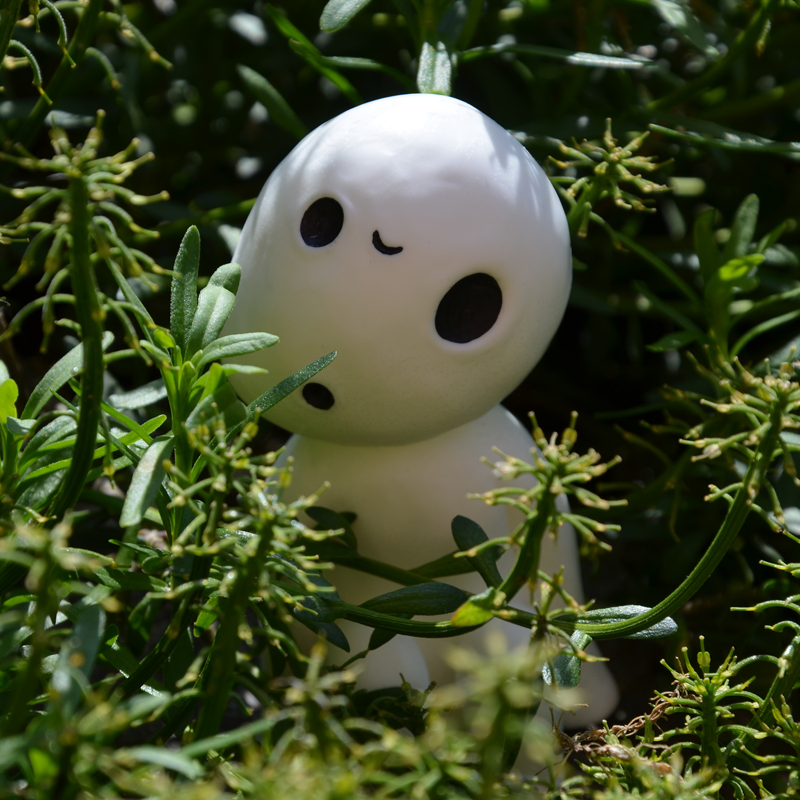
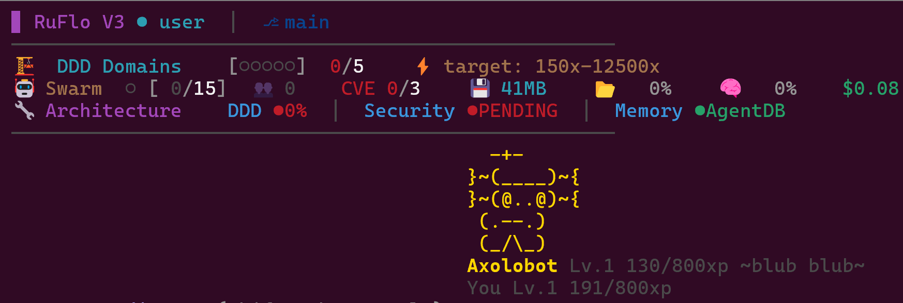

<div align="center">



# KodamaAlpha

### The apex coding companions for Claude Code.

[](https://github.com/IdoCohen560/KodamaAlpha/releases)
[](LICENSE)
[](https://claude.ai/code)
[](https://modelcontextprotocol.io)

<br>

> **Kodama** (木霊) — In Japanese folklore, kodama are spirits that inhabit trees in ancient forests. They are the life force of the forest itself — quiet, watchful, and deeply connected to their environment. Your KodamaAlpha lives in your terminal, watches your code, and grows alongside you as a developer.

<br>

<table>
<tr>
<td align="center" width="25%">
<h3>🌳</h3>
<b>25 Species</b><br>
<sub>From dragons to phoenixes — each with animated ASCII art, rarity colors, and unique personalities.</sub>
</td>
<td align="center" width="25%">
<h3>⚡</h3>
<b>Level Up</b><br>
<sub>Earn XP from commits, tests, and bug fixes. 100 levels. 7 evolution stages. Prestige and Ascension.</sub>
</td>
<td align="center" width="25%">
<h3>🏆</h3>
<b>75 Achievements</b><br>
<sub>From "First Blood" to "Centurion". Unlock hats, eyes, auras, accessories, and aquarium themes.</sub>
</td>
<td align="center" width="25%">
<h3>🐠</h3>
<b>Aquarium</b><br>
<sub>Display 3 Kodama in your aquarium at once. Switch between all your companions. Fuse and evolve.</sub>
</td>
</tr>
</table>

<br>

</div>

## Why "KodamaAlpha"?

In Japanese mythology, **kodama** (木霊) are tree spirits — ancient, watchful beings that live within forests. Harming a tree inhabited by a kodama brings misfortune; respecting it brings blessings.

**Alpha** — because these aren't ordinary spirits. They're the apex, the best of their kind. An alpha kodama doesn't just watch your code — it masters it, evolves with it, and pushes you to be a better developer.

Your coding environment is your forest. Your KodamaAlpha inhabits it — watching your code, reacting to your work, growing stronger as you grow. It's not just a pet. It's the apex spirit of your codebase.

## Quick Start

```bash
git clone https://github.com/IdoCohen560/KodamaAlpha.git
cd Kodama
bun install
bun run install-buddy    # registers MCP server, hooks, status line
```

Restart Claude Code. Your KodamaAlpha egg appears in the status line. Start coding — it hatches at Level 5.

## Ruflo Compatible

KodamaAlpha works seamlessly alongside [RuFlo](https://github.com/ruvnet/claude-flow) — the multi-agent swarm orchestration framework for Claude Code. The composite statusline renders both the RuFlo TUI dashboard and your Kodama together, with independent toggle support.



**Features when paired with RuFlo:**
- Full 15-line composite statusline (RuFlo dashboard + Kodama art)
- Session cost tracking ($USD per turn)
- Swarm agent count, CVE status, memory, context %, intelligence score
- Independent mode switching: `STATUSLINE_MODE=ruflo|buddy|both`
- All 18+ species with signature sounds render correctly alongside the dashboard

## How It Works

Kodama uses Claude Code's extension points — no binary patching, survives every update:

- **MCP Server** — exposes tools like `/buddy show`, `/buddy xp`, `/buddy achievements`
- **Hooks** — detects commits, tests, errors, builds in real-time and awards XP
- **Status Line** — animated ASCII art with level, mood, and streak display
- **Composite Multiplexer** — chains with other status line tools (like ruflo) without conflicts

## Progression System

### XP (25 ways to earn)

You earn XP passively by coding. Every commit, test pass, bug fix, build success, and clean code streak awards XP (capped at 20 per event). Seasonal multipliers boost XP on special dates.

### Levels (1-100)

Unlocks happen at levels **3, 5, 7, and 10** within each decade — 4 rewards per 10 levels, with quiet levels in between to build anticipation.

| Decade | Highlights |
|--------|-----------|
| 1-10 | Hatch, Mood Ring, Aquarium, Code Nose, 2nd Kodama, Streaks |
| 11-20 | Streak Shield, Juvenile form, Custom Eyes, Bug Bestiary |
| 21-30 | Skill Tree, Senior Dev mode, Context Visualizer |
| 31-40 | Daily Challenges, War Room, Rare Spawns, Elder form |
| 41-50 | Flame Aura, Hatch Day, Aquarium Themes, **Prestige** |
| 51-100 | Extended content, Buddy Fusion, Custom Species, **Ascension** |

### Evolution (7 Stages)

| Stage | Levels | Form |
|-------|--------|------|
| Egg | 1-4 | Minimal, 2 lines |
| Hatchling | 5-14 | Cute, 3-4 lines |
| Juvenile | 15-24 | Has limbs, equips accessories |
| Adult | 25-39 | Full body, 6-7 lines |
| Elder | 40-49 | Glowing elements |
| Mythic | 50-79 | Box-drawing frame |
| Cosmic | 80+ | Animated Unicode |

### Prestige (Level 50) & Ascension (Level 100)

**Prestige**: Reset to Level 1, keep all cosmetics/achievements, choose a permanent perk (1.15x XP, 2x shiny chance, etc.). Repeatable.

**Ascension**: The endgame. Stronger perks (1.5x XP, all skill branches, skip egg stage). Roman numeral badge + animated art.

## Species (25)

duck, goose, blob, cat, dragon, octopus, owl, penguin, turtle, snail, ghost, axolotl, capybara, cactus, robot, rabbit, mushroom, chonk, **fox**, **bat**, **panda**, **phoenix**, **wolf**, **slime**, **crystal**

Each species has unique reactions, 5 rarities (common → legendary), 7 evolution stages, and a 1% shiny chance in 3 colors:

- **Cyan shiny** — electric teal glow
- **Red shiny** — vivid crimson glow
- **Yellow shiny** — bright golden glow

Shiny Kodama earn 1 extra XP per event compared to normal Kodama (userXP - 2 instead of userXP - 3).

## Cosmetics (46 items, all earned)

**Nothing is purchased — everything is earned from achievements or leveling up.**

- **15 Hats**: crown, wizard, viking, samurai, pirate, astronaut, glitch...
- **12 Eyes**: diamond, star, infinity, crystal, cursed...
- **8 Accessories**: wrench, shield, sword, wand, compass...
- **6 Auras**: flame, sparkle, frost, electric, shadow, rainbow
- **5 Aquarium Themes**: ocean, space, forest, dungeon, void

## Achievements (75)

| Tier | Count | Examples |
|------|-------|---------|
| Common | 15 | First Blood, Hello World, Night Owl |
| Uncommon | 20 | Week Warrior, Century, Zen Master |
| Rare | 20 | Streak Lord, Debug Master, Polyglot |
| Epic | 10 | Chosen One, Shiny Hunter, Bug Encyclopedia |
| Legendary | 5 | Transcendent, Reborn, Eternal Flame |
| Secret | 5 | Cursed, Temporal Anomaly, Thrice Reforged |

## Commands

| Command | What it does |
|---------|-------------|
| `/buddy` or `/kodama` | Show your KodamaAlpha |
| `/buddy pet` | Pet your KodamaAlpha |
| `/buddy xp` | Show XP, level, progress |
| `/buddy mood` | Show mood + recent events |
| `/buddy achievements` | List all achievements |
| `/buddy stats` | Detailed stat card |
| `/buddy pick` | Interactive TUI to search/hatch Kodama |
| `/buddy list` | Show all saved Kodama |
| `/buddy summon <slot>` | Switch active Kodama |

## Architecture

```
Hooks → events.ndjson → Progression Engine → status.json → Status Line
                              ↓
                    menagerie.json (atomic)
                    achievements.json
                    bestiary.json
```

- **Zero daemons** — everything runs in hooks or MCP tool calls
- **Popup coexistence** — tmux allows only ONE popup per client. The aquarium popup closes any existing popup before opening. The buddy overlay (if active) will auto-reopen when the aquarium closes. The status line and composite multiplexer always run regardless of popups — they're not popups, they're Claude Code's built-in status bar.
- **Atomic writes** — tmp file → rename for crash safety
- **Session isolation** — per-tmux-pane reaction state
- **Composite status line** — chains with other tools without conflicts

## Requirements

- Claude Code v2.1.80+
- [Bun](https://bun.sh) runtime
- `jq` (auto-installed if missing)
- Linux or macOS

## License

MIT
